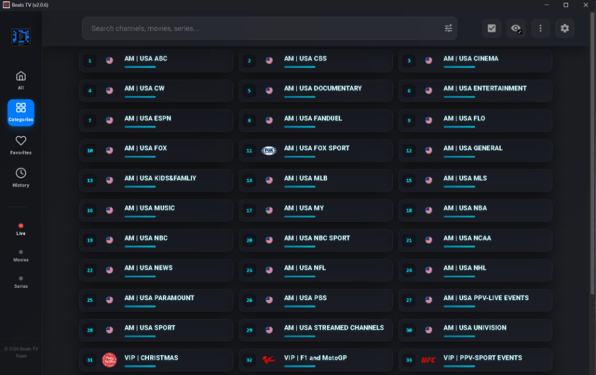

  

<h1 align="center">Beats TV 📺✨</h1>

  <strong>The Best Free Windows IPTV Open Source Client</strong> 
  <em>Premium Glassmorphism • High Performance • Entirely AI Vibe-Coded</em>

  
  
  
  

---

## 💎 The Ultimate IPTV Experience for Windows

Beats TV is a next-generation **IPTV player for Windows**, engineered for enthusiasts who demand both performance and aesthetic perfection. Unlike dated, clunky players, Beats TV offers a **Glassmorphism UI** that feels right at home on modern desktops.

Whether you're looking for a **Free M3U Player**, a **Xtream Codes Desktop Client**, or a reliable way to watch **Live TV and VOD (Movies & Series)** on PC, Beats TV is the open-source solution that delivers.

---

## 🚀 The "Vibe Coded" Revolution

> "I tried to commit minor changes to the original repo but got dinged for 'vibe coding'. So I decided to take the vibes to the absolute limit."

Beats TV is a fork of [Open TV](https://github.com/fredolx/open-tv) that has been **100% vibe-coded and remixed using [Google Antigravity](https://github.com/google-deepmind/antigravity) and [Kilo Code](https://kilo.code) ✨ by a non-engineer.**

This project is a masterclass in modern **Agentic AI Coding**. It proves that with a strong aesthetic vision and the elite power of **Google Antigravity**, anyone can build world-class, premium software. No engineering degree required—just pure vision and elite vibes.

---

## ⚡ Quick Start (Get Streaming in 60 Seconds)

Looking to setup your IPTV on Windows? Follow these simple steps:

1. 📥 **[Download Latest Beats TV .exe](https://github.com/officebeats/beats-tv/releases/latest)**
2. ⚙️ **Run the Installer** and launch the app.
3. 📡 **Add Your Source**: Enter your **Xtream Codes** login or paste an **M3U Playlist URL**.
4. 🍿 **Kick Back**: Experience 4K-ready streaming with ultra-low latency.

---

## 🔥 Elite Features

### 🎨 Stunning Visuals

- **Smooth Glass UI**: A premium frosted-glass design system.
- **Animated Backgrounds**: Live GPU-accelerated shader wallpapers (Aurora, Flow, and more).
- **Dark & Matrix Themes**: Switch between high-end glass and "hacker mode" terminal styles.

### 🛠️ Pro-Grade Playback

- **MPV Engine Integration**: The industry standard for high-performance video.
- **Advanced Medical Check**: Real-time diagnostic tool that scans for MPV, FFmpeg, and YT-DLP.
- **Hardware presets**: One-click GPU optimization profiles (_Performance+, Stable, Enhanced_).
- **External Player support**: Seamlessly launch streams into VLC or external MPV.

### 📂 Superior Content Library

- **Complete IPTV Support**: Xtream Codes API, M3U Playlists, and manual channel imports.
- **DVR & Recording**: Record live streams directly to your local drive.
- **Full EPG Integration**: Stay organized with an interactive Electronic Program Guide.
- **Automatic VOD Sorting**: Movies and Series organized by Genre, Release Date, and History.

---

## 🛠️ Performance Stack

- **Frontend**: Angular 19+ (Modern Reactive UI)
- **Engine**: Tauri (Rust-powered native performance)
- **Visuals**: Three.js (Hardware-accelerated shader backgrounds)
- **Package Manager**: pnpm

---

## 🔗 Connect With the Visionary

Interested in the future of AI coding, product management, or just want to support the vibes from **Ernesto "Beats"**:

  
  

---

## 📜 Credits

- **Founder**: Huge thanks to [Fredolx](https://github.com/fredolx) for the foundation of [Open TV](https://github.com/fredolx/open-tv).
- **License**: Licensed under [GPL-2.0](LICENSE).

---

If you love this open-source IPTV client and want to see more vibe-coded features, please consider supporting the project!
